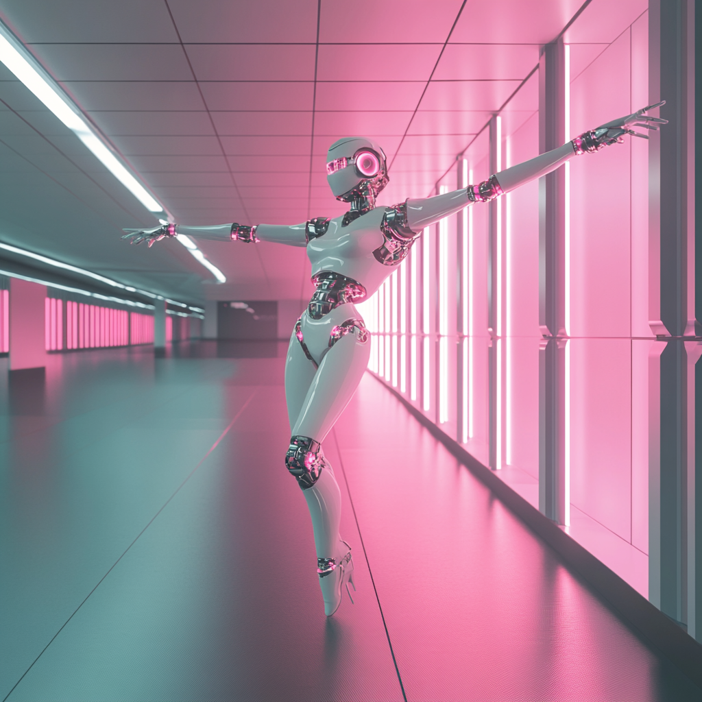

## Workflow

Save the image below, then drag and drop to ComfyUI  it to load the corresponding workflow

[Workflow](city96_GGUF_HunyuanVideo_I2V.json)

## Model Download
Download the following models:
- [llava_llama3_vision.safetensors](https://huggingface.co/Comfy-Org/HunyuanVideo_repackaged/resolve/main/split_files/clip_vision/llava_llama3_vision.safetensors?download=true)
- [clip_l.safetensors](https://huggingface.co/Comfy-Org/HunyuanVideo_repackaged/resolve/main/split_files/text_encoders/clip_l.safetensors?download=true)
- [llava_llama3_fp16.safetensors](https://huggingface.co/Comfy-Org/HunyuanVideo_repackaged/resolve/main/split_files/text_encoders/llava_llama3_fp16.safetensors?download=true)
- [llava_llama3_fp8_scaled.safetensors](https://huggingface.co/Comfy-Org/HunyuanVideo_repackaged/resolve/main/split_files/text_encoders/llava_llama3_fp8_scaled.safetensors?download=true)
- [hunyuan_video_vae_bf16.safetensors](https://huggingface.co/Comfy-Org/HunyuanVideo_repackaged/resolve/main/split_files/vae/hunyuan_video_vae_bf16.safetensors?download=true)
- [GGUF](https://huggingface.co/city96/HunyuanVideo-I2V-gguf/) 

After downloading, please organize the files as shown below and save them in the corresponding folders under `ComfyUI/models`

```
ComfyUI/
├── models/
│   ├── clip_vision/
│   │   └── llava_llama3_vision.safetensors
│   ├── text_encoders/
│   │   ├── clip_l.safetensors
│   │   ├── llava_llama3_fp16.safetensors
│   │   └── llava_llama3_fp8_scaled.safetensors
│   ├── vae/
│   │   └── hunyuan_video_vae_bf16.safetensors
│   └── unet/
│       └── hunyuan-video-i2v-720p-Q4_K_M.gguf // Depends on the model you choose
```

## Input Image

Download the image below as input image




